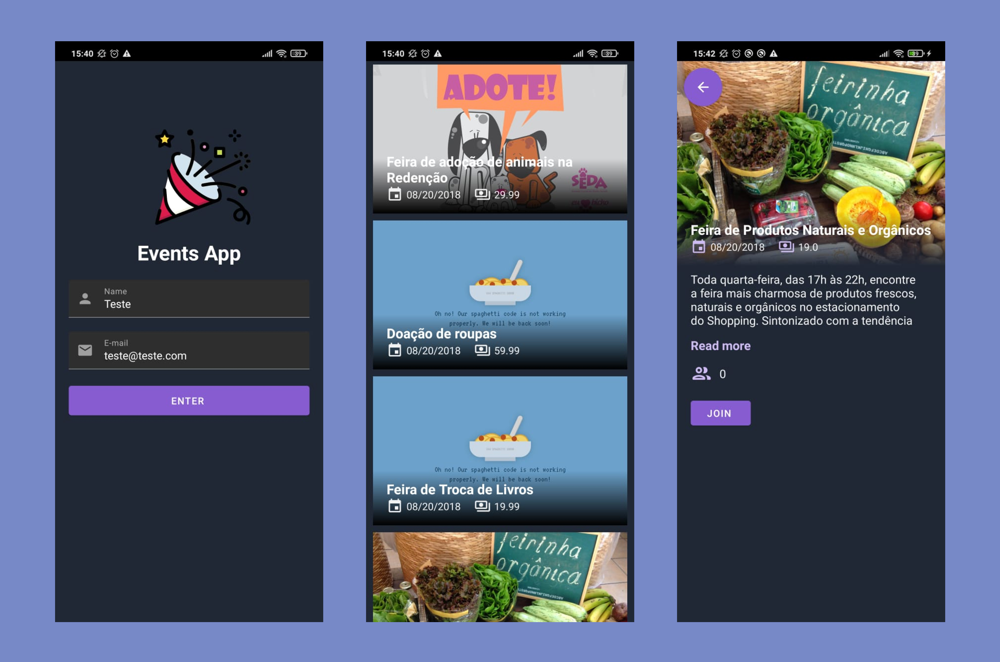

# SicrediTest

Teste https://github.com/WoopSicredi/jobs/issues/1

## Sobre o projeto

Um aplicativo Android que exibe eventos.

## Arquitetura
A arquitetura escolhida foi o MVVM. 

### Fluxo de dados

O [EventService](https://github.com/diegoleonds/SicrediTest/blob/main/app/src/main/java/com/example/eventsapp/data/service/EventService.kt) é chamado por um viewModel e retorna um dado "embrulhado" em um [Result](https://github.com/diegoleonds/SicrediTest/blob/main/app/src/main/java/com/example/eventsapp/data/model/Result.kt) (que pode ter um dos estados: Success, Fail e Loading), quando o viewModel recebe esse dado ele é colocado em um LiveData para que a view observe.

O objetivo de usar o Result para embrulhar os dados é permitir que cada camada da aplicação possa lidar, dentro de suas responsabilidas, com possíveis erros.

## Feito com
- [Android SDK](https://developer.android.com/) - Create an Android App
- [Kotlin](https://developer.android.com/kotlin) - Develop Android apps with Kotlin
- [Coroutines](https://kotlinlang.org/docs/coroutines-overview.html) - Asynchronous or non-blocking programming
- [Retrofit](https://square.github.io/retrofit/) - A type-safe HTTP client for Android
- [Glide](https://github.com/bumptech/glide) - Fast and efficient image loading for Android
- [Navigation](https://developer.android.com/guide/navigation) - An easier way to navigate in Android
- [Koin](https://insert-koin.io/) - Dependency injection
- [Material Design](https://material.io/develop/android/) - Material Components for Android
- [MockK](https://mockk.io/) - Mock library for tests
